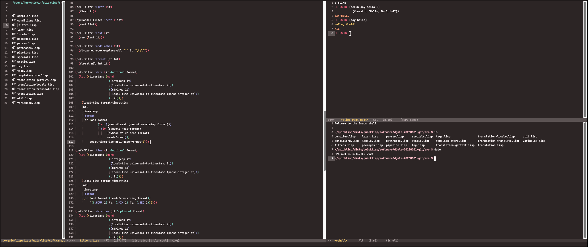

# λ .dotfiles

## .emacs

A fast, clean, ready-to-use config for macOS. Drop it into your `~/` directory (after installing the prereqs in the header) and it should work.

* Short (< 200 LOC)
* Lines of code are clearly commented. Easy to customize.
* Centered around functional programming (Lisp, OCaml, Haskell) but can be easily adapted to other languages.
* Style inspired by Sublime Text, VSCode and other "modern" editors:
  - file navigation sidebar
  - cleanly denotes indentation levels
  - automatically picks up files as they change on disk
  - easily work with Markdown and git
* Automatically installs all necessary packages.
* Uses Monokai Pro Filter Ristretto theme (easy to change)
  
